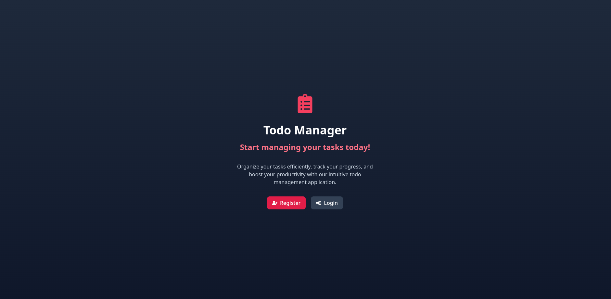
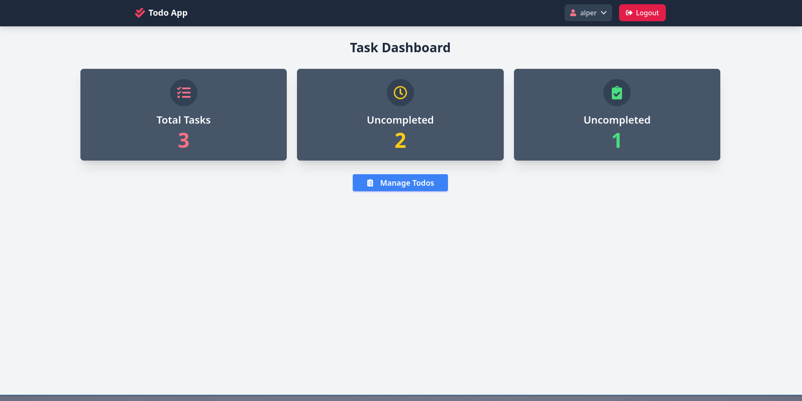
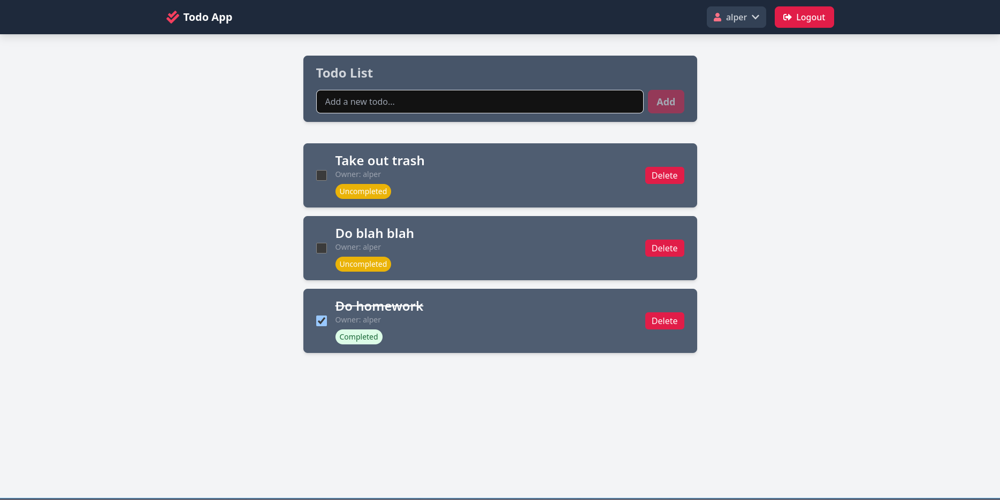

# Minustodo - Task Management Application

[](https://reactjs.org/)
[](https://spring.io/projects/spring-boot)
[](https://www.keycloak.org/)
[](https://tailwindcss.com/)

A modern, secure task management application built with React and Spring Boot, featuring Keycloak authentication.

## 📸 Screenshots

### Login Page


### Dashboard


### Todo Management


## ✨ Features

- **Secure Authentication**: OAuth 2.0 / OpenID Connect with Keycloak
- **Task Management**: Create, read, update, and delete tasks
- **Task Statuses**: Mark tasks as complete or incomplete
- **User-specific Tasks**: Each user can only see and manage their own tasks
- **Responsive UI**: Modern interface built with React and Tailwind CSS
- **Dashboard**: View task statistics and summaries
- **Data Persistence**: PostgreSQL database for reliable storage

## 🏗️ Architecture

### Backend

- **Framework**: Spring Boot 3.4.2
- **Database**: PostgreSQL 15
- **Authentication**: OAuth 2.0 Resource Server with Keycloak
- **Database Migration**: Flyway
- **Packaging**: Docker

### Frontend

- **Framework**: React 19 with TypeScript
- **Routing**: React Router 7
- **State Management**: React Hooks
- **Authentication Client**: Keycloak JS
- **HTTP Client**: Axios
- **CSS Framework**: Tailwind CSS with DaisyUI
- **Build Tool**: Vite

### Infrastructure

- **Containerization**: Docker and Docker Compose
- **Identity Provider**: Keycloak 24.0

## 🔍 Prerequisites
a
- Java 17 or higher
- Node.js 16 or higher
- Docker and Docker Compose
- PostgreSQL 15 (if running locally)

## 🚀 Getting Started

### Clone the Repository

```bash
git clone https://github.com/yourusername/minustodo.git
cd minustodo
```

### Docker Setup (Recommended)

The easiest way to run the complete stack is using Docker Compose:

```bash
docker-compose up
```

This will start:
- PostgreSQL database
- Keycloak server on port 8180
- Backend API server on port 8081
- Frontend development server on port 3000

### Backend Setup

If you prefer to run the backend manually:

1. Ensure PostgreSQL is running with the following configurations:
   - Database: `task`
   - Username: `postgres`
   - Password: `postgres`
   - Port: `5432`

2. Run the Spring Boot application:

```bash
./mvnw spring-boot:run
```

The backend will be available at `http://localhost:8081`.

### Frontend Setup

To run the frontend separately:

1. Navigate to the frontend directory:

```bash
cd frontend
```

2. Install dependencies:

```bash
npm install
```

3. Start the development server:

```bash
npm run dev
```

The frontend will be available at `http://localhost:3000`.

### Keycloak Setup

If you're not using Docker Compose, you'll need to configure Keycloak manually:

1. Download and run Keycloak 24.0
2. Create a new realm named `task`
3. Create a client called `taskapi` with the following settings:
   - Client Protocol: `openid-connect`
   - Access Type: `public`
   - Valid Redirect URIs: `http://localhost:3000/*`
   - Web Origins: `+`

## 🔐 Authentication

The application uses Keycloak for authentication and authorization:

- **Login Flow**: Standard OpenID Connect Authorization Code flow with PKCE
- **User Registration**: Available through the Keycloak registration page
- **Token Management**: Automatic token refresh handled by the frontend

## 📚 API Documentation

### Task Endpoints

| Method | Endpoint | Description | Authentication |
|--------|----------|-------------|----------------|
| GET    | /task/get | Get all tasks for current user | Required |
| POST   | /task/addTask | Create a new task | Required |
| PUT    | /task/completed | Mark task as completed | Required |
| PUT    | /task/uncompleted | Mark task as uncompleted | Required |
| DELETE | /task/delete/{taskId} | Delete a specific task | Required |
| DELETE | /task/deleteAll | Delete all tasks for current user | Required |
| GET    | /task/{task} | Search tasks by name | Required |
| GET    | /task/getAllTasks | Get all tasks (admin only) | Admin role required |

## 📁 Project Structure

### Backend Structure

```
src/main/java/com/project/todo_app/
├── config/          # Configuration classes (Security, Keycloak)
├── controller/      # REST API controllers
├── model/           # Domain entities and DTOs
├── repository/      # Data access interfaces
├── service/         # Business logic services
└── TodoAppApplication.java  # Application entry point
```

### Frontend Structure

```
frontend/
├── public/          # Static assets and HTML
├── src/
│   ├── api/         # API integration
│   ├── auth/        # Authentication logic
│   ├── components/  # React components
│   ├── hooks/       # Custom React hooks
│   ├── types/       # TypeScript type definitions
│   ├── App.tsx      # Main application component
│   └── main.tsx     # Entry point
└── package.json     # Dependencies and scripts
```

## 📄 License

My application is free to use use it however you like!

---

